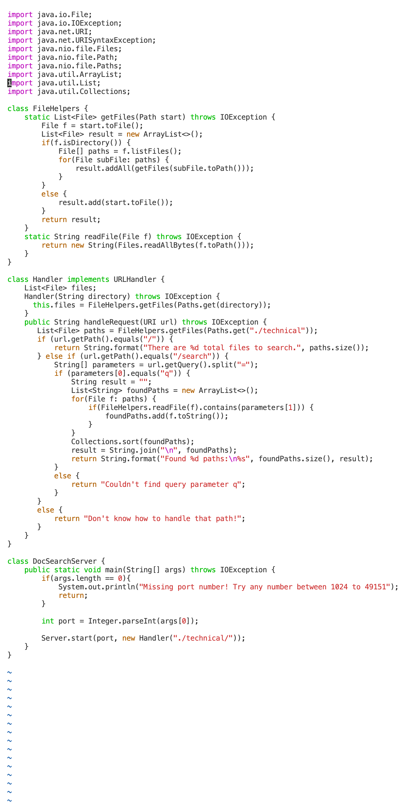
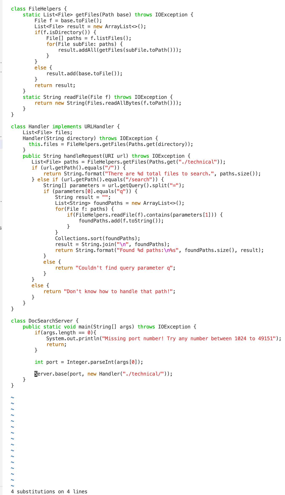

## Lab Report 4/ Week 7 Lab report
**Part 1**

> Changing the name of the start parameter and its uses to base

Less Than 30 Total Keys Pressed:

```
vim<space><shift>D<tab><Enter> 
|| (or)
vim Doc SearchServer.java
```
In the skill-demo1 directory, use vim to open the SearchServer.java file or use the initials + tab to quickly find the file.


```
:%s/start/base<Enter>
```
The % range means "the whole file". And you can find and replace text using the :substitute ( :s ) command. Next, find the full text of start and replace it with base.



```
:wq<Enter>
```
Finally save and exit.

**Part2**
> scp on VS Code

This step takes almost 2 minutes, and the point that wastes time is having to log in to the remote repeatedly.

>Vim

This step took one and a half minutes, and the point of wasting time was that I was not familiar with the vim commands.

> Which of these two styles would you prefer using if you had to work on a program that you were running remotely, and why?

Now, I'd probably prefer to change the contents of the file on VS code. The simple reason is that I am currently more familiar with VS code and I can change the code quickly, the only hassle is to re-copy the file to the remote computer. If it's a repetitive step it's definitely easier to use Vim.

> What about the project or task might factor into your decision one way or another? (If nothing would affect your decision, say so and why!)

The complexity of the project will influence my decision, simple replace and add words Vim will be more straightforward and convenient. But extensive changes to the code would be better for me with VS Code.

